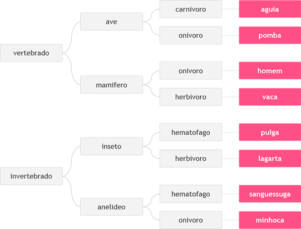

# Desafio Animal

Tipos de animais

# Criação

Criado em C#.

# Desafio

Neste problema, você deverá ler 3 palavras que definem o tipo de animal possível segundo o esquema abaixo, da esquerda para a direita. Em seguida conclua qual dos animais seguintes foi escolhido, através das três palavras fornecidas.

# Entrada

A entrada contém 3 palavras, uma em cada linha, necessárias para identificar o animal segundo a figura acima, com todas as letras minúsculas.

# Saída

Imprima o nome do animal correspondente à entrada fornecida.

# Execução

Exemplos de Entrada -
vertebrado /
mamifero /
onivoro

Exemplos de Saída -
homem

---

Exemplos de Entrada -
vertebrado /
ave /
carnivoro

Exemplos de Saída -
aguia

---

Exemplos de Entrada -
invertebrado /
anelideo /
onivoro

Exemplos de Saída -
minhoca
